# IWantFigure

일본 게임센터 크레인게임(クレーンゲーム / UFOキャッチャー) 기계를 스마트폰으로 찍으면, AI가 경품 배치 유형을 인식하고 "어디를 노려야 하는지"를 사진 위 마커와 3D 씬으로 추천해 주는 iOS/Android 앱.

> 참고용 추천이며 획득을 보장하지 않습니다. 촬영 전 매장의 촬영 규정을 확인하고, 다른 손님이 찍히지 않게 해 주세요. 사진 속 얼굴은 전송 전에 기기 안에서 자동으로 가려집니다.

## 구성

| 경로 | 내용 | 기술 |
|---|---|---|
| `app/` | 모바일 앱: 촬영 → 분석 → 사진 오버레이 / 3D 뷰 / 단계별 안내 → 플레이 관찰 → 결과 저장 | Flutter 3.47, Dart 3.13 (외부 3D·상태관리 패키지 없음) |
| `server/` | 분석 API: 이미지 리사이즈 → LLM(Gemini / Claude / Mock) → 좌표 정규화·스키마 검증 | ASP.NET Core, .NET 10 |
| `shared/` | 앱·서버 공용 계약: JSON 스키마, 시스템 프롬프트, 샘플 응답 | |
| `docs/` | 기획·기술 분석(`01`), 구현 가이드(`02`), 스토어·프라이버시(`03`), 진행 정리·로컬 가이드(`04`), 리서치 노트 | |

## 화면

| 홈 | 결과 · 사진 오버레이 | 결과 · 3D | 보정 모드 |
|---|---|---|---|
| 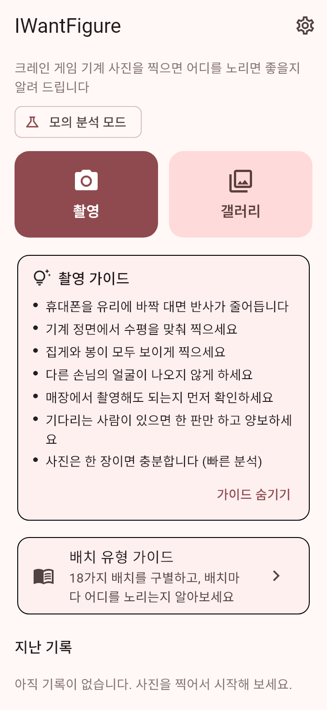 | 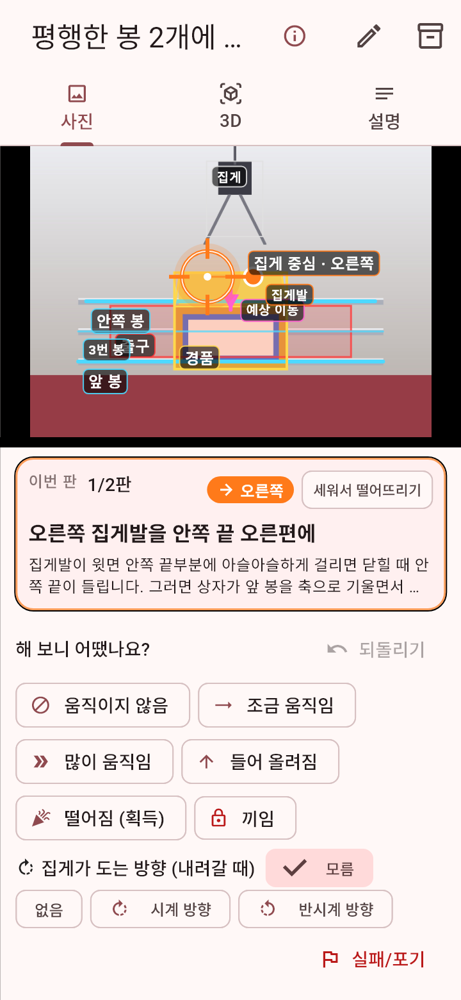 | 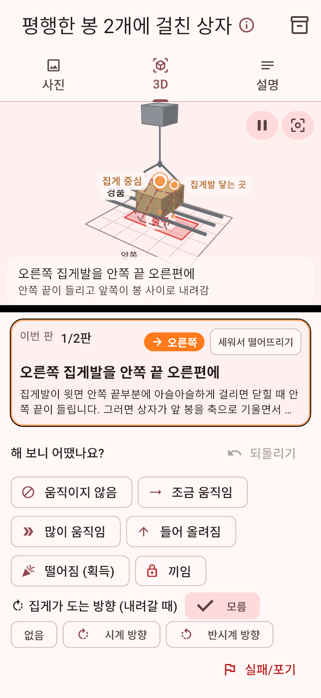 | 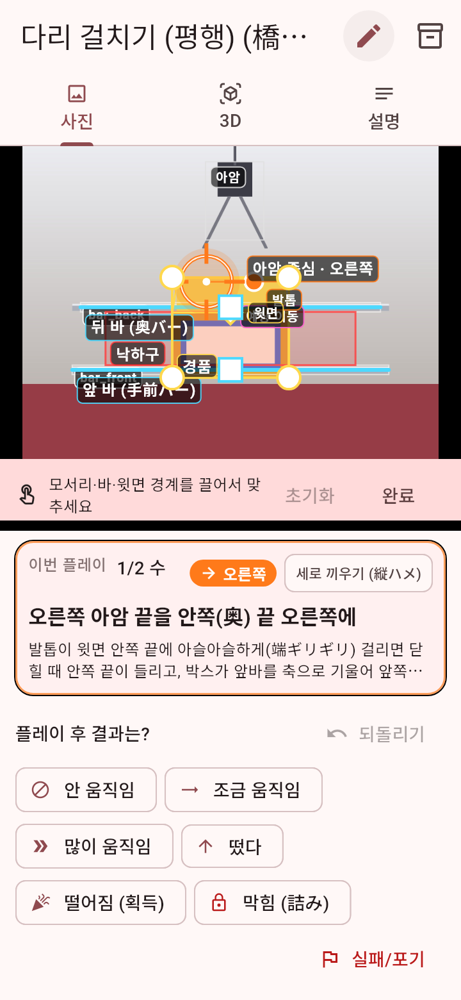 |

| 설명 탭 (EN) | 사진 탭 (JA) | 최초 실행 동의 | 설정 |
|---|---|---|---|
| 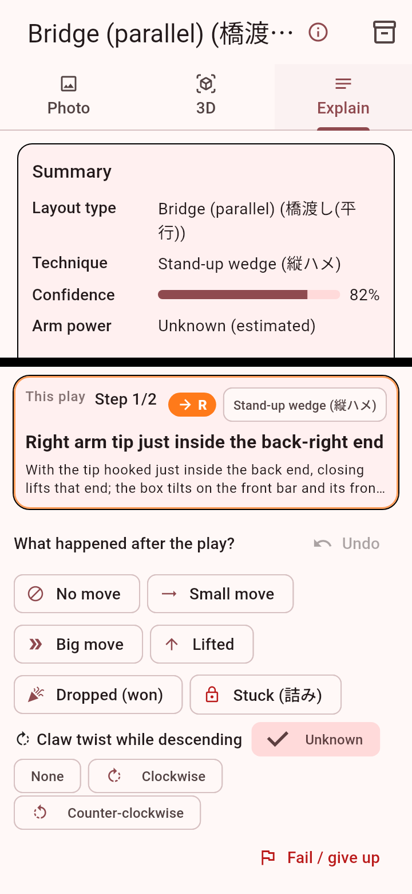 | 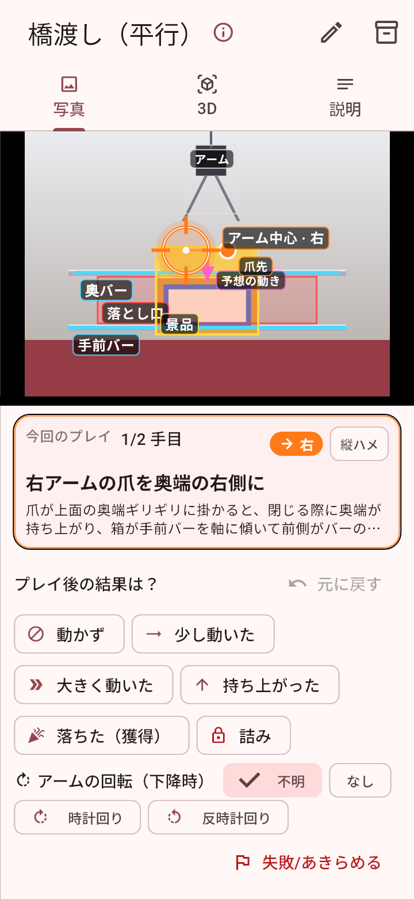 | 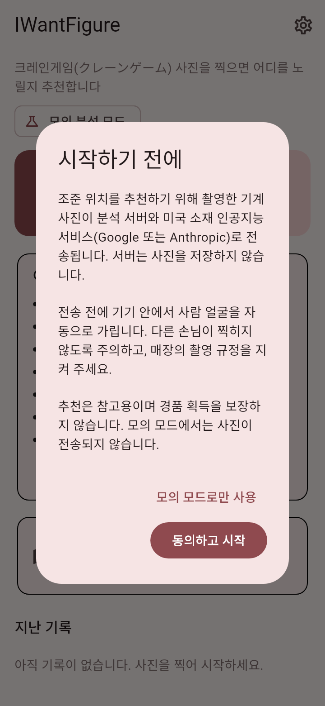 | 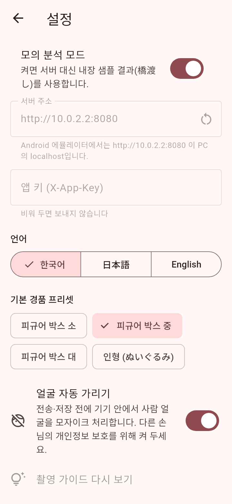 |

| 3본 바 + 집게 회전 보정 | 3D (회전 화살표) | 배치 유형 가이드 | 가이드 상세 |
|---|---|---|---|
| 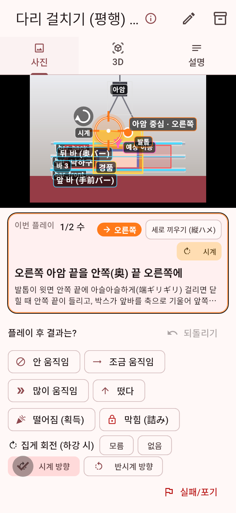 | 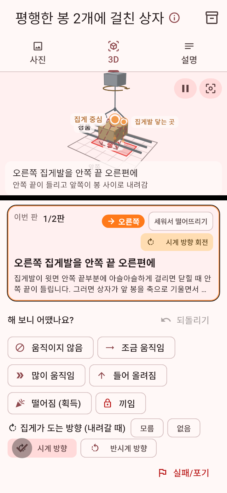 | 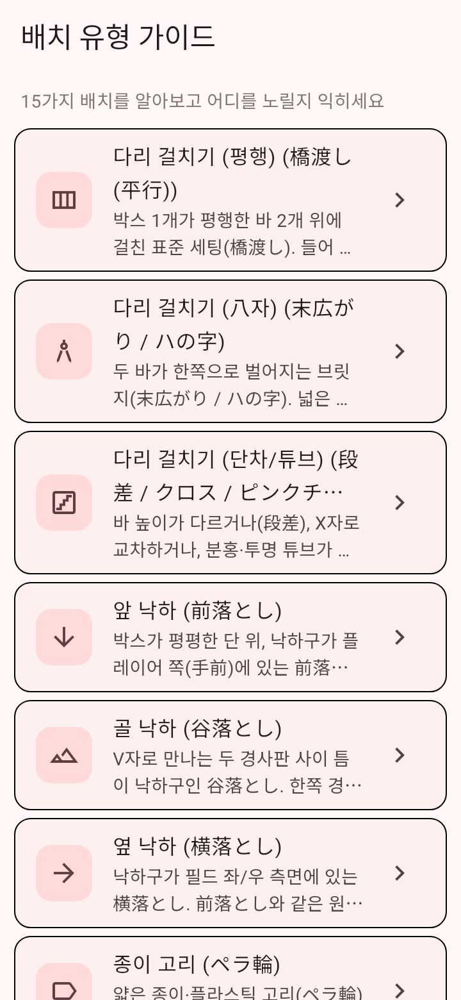 | 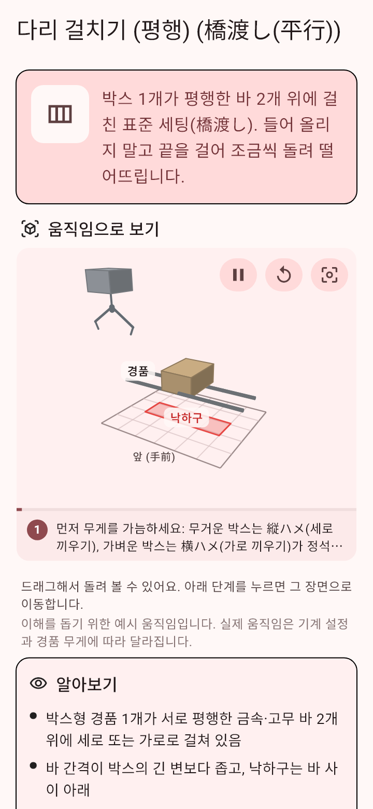 |

캡처는 실제 앱을 위젯 테스트로 렌더링한 것입니다(모의 분석 + 합성 사진). 재생성: `app` 폴더로 이동한 뒤 `flutter test tool/screenshots_test.dart`를 실행합니다(한글·일본어 폰트 준비는 [`docs/04`](docs/04_진행정리_로컬개발_가이드.md) 3-8).

## 빠른 시작

로컬 PC에서 이어서 개발하려면(설치할 도구, develop 브랜치, 에뮬레이터·서버 연결, 자주 나는 오류) [`docs/04_진행정리_로컬개발_가이드.md`](docs/04_진행정리_로컬개발_가이드.md)를 참고하세요.

앱은 기본이 **모의(mock) 모드**라 서버 없이도 전체 흐름이 동작합니다.

```bash
cd app
flutter pub get
flutter test          # 엔진·3D·UI 테스트
flutter run           # 기기 또는 에뮬레이터
```

실제 분석을 쓰려면 서버를 띄우고(아래), 앱 설정에서 모의 모드를 끄고 서버 URL을 입력합니다(Android 에뮬레이터 → `http://10.0.2.2:8080`).

```bash
cd server
export Analysis__Provider=gemini      # 또는 claude
export Gemini__ApiKey=...             # 또는 Claude__ApiKey=...
dotnet run --project IWantFigure.Server   # http://localhost:8080
```

Windows PowerShell은 `$env:Analysis__Provider = "gemini"` 형식입니다. 키는 환경변수보다 `dotnet user-secrets`에 두는 것을 권장합니다([`docs/04`](docs/04_진행정리_로컬개발_가이드.md) 3-5).

API 키는 서버에만 둡니다. 앱은 이 서버와만 통신합니다. 자세한 설정과 curl 예시는 `server/README.md`.

## 동작 원리(요약)

1. 앱이 사진을 장변 1,456px로 줄여 서버에 보냅니다.
2. 서버가 LLM에 사진 + 배치 유형 분류 체계(橋渡し, 前落とし, ペラ輪, 3本爪 …)를 주고 **유형·객체 박스·기법·설명**을 JSON으로 받습니다.
3. 앱의 **룰 엔진**이 객체 박스와 경품 치수, 사용자 보정, 플레이 관찰(안 움직임/떴다/떨어짐 …), 집게 하강 회전 방향(시계/반시계)으로 **조준점과 다음 수**를 계산합니다. 바가 3·4개인 세팅도 지지 바 쌍을 골라 처리합니다. 좌표는 LLM에게 맡기지 않습니다.
4. 사진 오버레이와 파라메트릭 3D 씬(바·경품·아암·낙하구·예상 움직임·집게 회전 화살표)으로 보여 줍니다.
5. 15가지 배치 유형별 **기초 가이드**(알아보기 → 이렇게 노리기 → 기법 → 팁 → 철수 조건)를 홈과 결과 화면에서 바로 열 수 있습니다. 14개 유형은 **3D 모션 데모**로 집게와 경품이 단계별로 어떻게 움직이는지 보여 주고, 단계를 누르면 그 장면으로 이동합니다.

## 문서

- [`docs/01_기획_기술_분석.md`](docs/01_기획_기술_분석.md) — 시장·도메인 지식·기술 선택·로드맵·리스크
- [`docs/02_MVP_구현_가이드.md`](docs/02_MVP_구현_가이드.md) — 코드 구조, 좌표계, 룰 엔진, 실행법, 남은 일
- [`docs/03_스토어_준비_프라이버시.md`](docs/03_스토어_준비_프라이버시.md) — 프라이버시 정책 초안, 심사 리뷰 노트, 출시 체크리스트
- [`docs/04_진행정리_로컬개발_가이드.md`](docs/04_진행정리_로컬개발_가이드.md) — 지금까지의 진행 정리, 로컬 개발 환경 설정, 다음 할 일
- [`docs/research/`](docs/research/) — 영역별 리서치 노트
