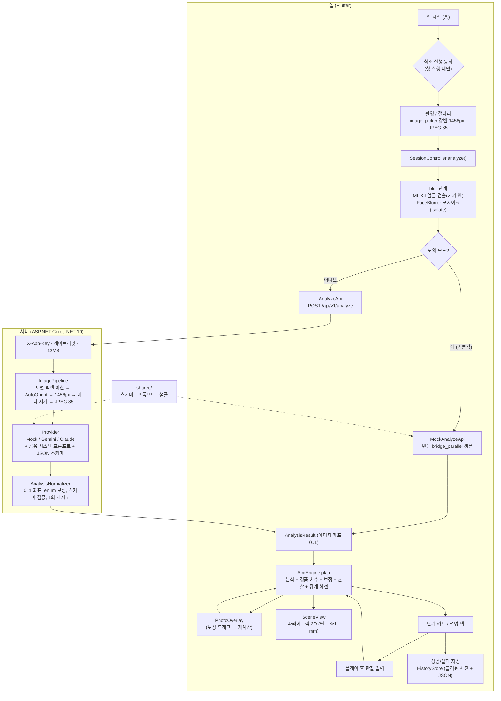

# IWantFigure 진행 정리 및 로컬 개발 가이드 (작성일 2026-09-25)

이 문서는 클라우드 세션에서 해 온 작업을 한곳에 정리하고, 사용자 PC에서 이어서 개발하는 방법을 설명합니다. 사용자 PC는 Windows로 가정해(확정 아님) 설명하고, macOS 차이는 따로 표시합니다.

- 표기: **(실측)** = 클라우드 환경에서 직접 실행해 확인함. **(확인 필요)** = 문서·일반 지식 기반이며 여기서는 검증하지 못함.
- **클라우드 환경은 Linux입니다. Windows·PowerShell·cmd 명령과 Android/iOS 빌드 절차는 표시가 없어도 전부 이 환경에서 실행해 보지 못했습니다.** (실측)은 Linux에서 같은 동작을 확인했다는 뜻입니다.
- 명령 속 `<...>`는 **꺾쇠까지 지우고** 실제 값으로 바꿉니다(예: `<에뮬레이터 ID>` → `Pixel_8_API_36`). 꺾쇠를 남기면 셸이 리디렉션·연산자로 해석해 엉뚱한 오류가 납니다.
- 관련 문서: [`README.md`](../README.md), [`docs/01_기획_기술_분석.md`](01_기획_기술_분석.md), [`docs/02_MVP_구현_가이드.md`](02_MVP_구현_가이드.md), [`docs/03_스토어_준비_프라이버시.md`](03_스토어_준비_프라이버시.md), [`server/README.md`](../server/README.md), 루트 [`CLAUDE.md`](../CLAUDE.md)

---

## 1장. 한눈에 보기

| 항목 | 상태 |
|---|---|
| 저장소 | https://github.com/mireu9275/IWantFigure — 원격 브랜치는 `claude/japan-figure-gacha-ai-app-78bxf4` 하나뿐(develop·main 없음). 기능 개발 마지막 커밋 `acd37c6`(16번째) 뒤에 이 인수인계 문서를 넣은 `docs:` 커밋이 이어짐. PR 없음 |
| 앱(Flutter) | 촬영 → 얼굴 블러 → 분석 → 사진 오버레이/3D/설명 → 보정·관찰 → 저장, 15개 유형 가이드까지 구현(코드 기준, 얼굴 블러의 실기 동작은 아래 미검증 참고). `flutter test` **116건 통과**, `flutter analyze` **이슈 0** (실측) |
| 서버(.NET 10) | `POST /api/v1/analyze`, `GET /healthz`, Mock/Gemini/Claude 프로바이더. `dotnet test` **113건 통과**, Release 빌드 **경고 0** (실측). mock 서버 스모크 테스트 200 OK (실측) |
| CI | GitHub Actions에서 모든 브랜치 push·PR마다 Flutter analyze+test, .NET build+test. push마다 실행되며 지금까지 모두 성공(문서 작성 시점 5회) |
| **미검증** | Android 에뮬레이터/실기 빌드, iOS 빌드는 **한 번도 해 보지 못함**(클라우드에서 Android SDK 다운로드 차단, macOS 없음) |
| **미검증** | ML Kit 얼굴 검출·블러의 실기 동작(검출률·처리 시간). 테스트는 가짜/Noop 검출기만 사용. **검출 오류 시 경고 없이 원본 사진 전송(fail-open)** |
| **미검증** | 실제 Gemini/Claude API 호출(테스트는 가짜 HTTP만 사용), 실제 게임센터 사진으로 한 정확도 검증과 엔진 튜닝 |
| 다음 단계 | 로컬 PC에서 Android 에뮬레이터로 모의 모드 실행 → 서버 연결 → 실제 API 호출 (5장 체크리스트) |

---

## 2장. 지금까지 한 일

### (가) 단계별 타임라인

기능 커밋 1~16번은 2026-09-24(UTC), 인수인계 문서 커밋(17번 이후)은 2026-09-25에 올라갔습니다. 오래된 순서입니다. 문서 커밋의 해시는 리뷰 후 다시 커밋하면 바뀌므로 여기에 적지 않습니다.

| # | 커밋 | 날짜 | 내용 |
|---|---|---|---|
| 1 | `2b9654c` | 2026-09-24 | **기획·리서치**: `docs/01`(531줄)과 `docs/research/` 5개 노트. 배치 유형 15종 룰베이스, 하이브리드 파이프라인(LLM은 유형·박스·설명, 좌표는 룰 엔진), Flutter + ASP.NET Core 스택, 로드맵·리스크·비용. 일본어 출처는 대부분 검색 스니펫 근거라 ★ 표시 |
| 2 | `c770145` | 2026-09-24 | **앱 뼈대 + 엔진**: Flutter 프로젝트(Android/iOS), `shared/`(스키마·시스템 프롬프트·橋渡し 샘플), `AnalysisResult`, `Scene3D`, `AimEngine`. 엔진 테스트 10건 |
| 3 | `24ed8b8` | 2026-09-24 | **문서**: `docs/02_MVP_구현_가이드.md`(구조, 두 좌표계, 엔진 절차, 실행법) |
| 4 | `f831b83` | 2026-09-24 | **3D 뷰**: 외부 패키지 없이 `OrbitCamera` + 페인터 알고리즘 `ScenePainter`, `SceneView`(드래그 회전·핀치 줌·더블탭 리셋·애니메이션). 테스트 16건 |
| 5 | `f1215ce` | 2026-09-24 | **서버**: ASP.NET Core(.NET 10) 분석 API, 이미지 파이프라인, Mock/Gemini/Claude, 정규화·스키마 검증, X-App-Key, 레이트리밋, 12MB 제한, 재시도, Dockerfile. xUnit 73건 |
| 6 | `5473163` | 2026-09-24 | wip: 화면·서비스·오버레이·현지화 중간 저장(약 4,800줄) |
| 7 | `5b0fc12` | 2026-09-24 | **앱 화면 완성**: `SessionController`, 보정 직렬화. 총 58건 |
| 8 | `4d9fdd3` | 2026-09-24 | **README 갱신**: 구성, 빠른 시작, 동작 원리 |
| 9 | `e3affa9` | 2026-09-24 | **엔진/3D 리뷰 반영**: 横ハメ 회전 방향, yaw 보정 유지, 링·인형 앞뒤 반전, NaN 씬 방지, 경품 치수 '자동'. 총 63건 |
| 10 | `8b6d333` | 2026-09-24 | **서버 리뷰 반영**: 프록시 신뢰 목록, 힌트 입력 상한, 픽셀 예산·디코드 동시성 제한, Claude 파라미터, Retry-After. 서버 113건 |
| 11 | `764ed11` | 2026-09-24 | wip: 앱 UI 리뷰 반영 중간 저장 |
| 12 | `b1bd6e3` | 2026-09-24 | **앱 UI 리뷰 반영**: 히스토리 원자 저장·손상 대비, 분석 경합 방지, 오류 메시지 현지화, 타임아웃 75초, 줌·탭 제스처. 총 82건 |
| 13 | `3dabe6d` | 2026-09-24 | **개인정보·CI**: ML Kit 얼굴 자동 블러, 최초 실행 동의, iOS 15.5, GitHub Actions CI, `docs/03`(프라이버시 정책 초안 등). 총 91건 |
| 14 | `d95c953` | 2026-09-24 | **스크린샷 도구**: `app/tool/screenshots_test.dart`, `docs/images/` 생성, 테마 폰트 적용 |
| 15 | `bc3f9ed` | 2026-09-24 | **엔진 확장**: 3·4본 바 세팅(지지 쌍 선택), 집게 하강 회전 15° 보정, 3D 회전 화살표 |
| 16 | `acd37c6` | 2026-09-24 | **유형별 가이드**: 15개 유형 × ko/ja/en 가이드 화면, 집게 회전 입력 UI, 다중 바·회전 오버레이, 이모지 → Material 아이콘. 총 116건 |
| 17 | (`docs:` 커밋) | 2026-09-25 | **인수인계**: 이 문서(`docs/04`)와 루트 `CLAUDE.md` 추가, README 문서 목록 갱신, 스크린샷 도구 기본 폰트 경로를 `app/tool/fonts/`로 변경, `.gitignore`에 `app/tool/fonts/` 추가 |

> wip 커밋 2개(`5473163`, `764ed11`)는 바로 다음 커밋에서 마무리됐습니다. 나중에 main으로 PR을 만들 때 squash 여부만 정하면 됩니다.

### (나) 영역별 기능 목록

| 영역 | 구현된 것 |
|---|---|
| 기획·리서치 | 배치 유형 15종 → 인식 포인트 → 조준 전략 → MVP 우선순위 표, 기법 용어집 10종(寄せ, 押し込み, 持ち上げ, 縦/横ハメ, ずり上げ, 乗り上げ, 角押し, 突き, 引っ掛け, 雪崩), 파이프라인 3안 비교 → 하이브리드 채택(VLM 포인팅 정확도가 약 70%라 좌표는 룰 엔진), LLM 비용 추정, 로드맵 Phase 0~v3 |
| 앱 화면 흐름 | 앱 시작 시 홈 위에 최초 실행 동의 → 홈(촬영/갤러리, 촬영 가이드 카드, 가이드 진입, 히스토리) → 분석 중(준비 → 얼굴 가리기 → 서버 → 조준 계산, 오류별 메시지, 재시도·모의 분석 대체) → 결과(사진/3D/설명 3탭, 보정 모드, 경품 시트, 단계 카드, 관찰 6종 + 실행 취소, 집게 회전 선택, 성공/실패 저장) → 설정(모의 모드, 서버 URL, 앱 키, 언어, 경품 프리셋, 얼굴 자동 가리기). 히스토리에서 연 세션은 읽기 전용 |
| 조준 룰 엔진 | `AimEngine.plan(분석 + 경품 + 보정 + 관찰 + 로캘)` → `AimPlan`(단계, 오버레이, 3D 씬, 근거, 경고, 철수 조건). 유형별 허용 기법 목록, 橋渡し 무게·바 간격 규칙, ハの字 분기, `(u, v, arm)` 접점 규칙, 관찰 기반 아암 파워 추정, 단계 교대, 3·4본 바 지지 쌍 선택, 집게 회전 15° 보정, 詰み 시 점원 요청 안내, unknown·퇴화 bbox는 '보정 필요' 처리. 문구 ko/ja/en |
| 3D 뷰 | 순수 Dart 원근 투영(`OrbitCamera`), 페인터 알고리즘(`ScenePainter`): 바닥 그리드, 낙하구, 12각 바, 상자, 2/3발톱 아암, 조준 마커, 예상 움직임 고스트, 회전 화살표, 手前 라벨. 드래그 회전·핀치 줌·더블탭 리셋·1.6초 반복 애니메이션 |
| 사진 오버레이·보정 | 레터박스 좌표 매핑, 경품 bbox·윗면·앞/뒤 바·추가 바·낙하구·아암·조준 마커·예상 움직임 화살표·회전 글리프. 보정 드래그(모서리 4개, 박스 이동, 앞/뒤 바, 윗면 경계). 경품 시트(S/M/L/인형 프리셋, 치수·무게, 앞뒤 오프셋, 윗면 비율, yaw) |
| 유형별 가이드 | 15개 유형 × ko/ja/en: 요약, 알아보기, 이렇게 노리기, 기법, 팁, 철수 조건, 참고 비용(★). 홈 카드·결과 화면 제목·설명 탭에서 진입 |
| 개인정보 | ML Kit 온디바이스 얼굴 검출 + 순수 Dart 모자이크(isolate). 업로드·표시·저장 모두 블러본 사용. 최초 실행 동의, `blur_faces` 기본 ON. 서버는 EXIF/GPS 제거, 디스크 미저장, 이미지·키 미로깅 (얼굴 검출은 실기 미검증, 2장 (사) #4) |
| 히스토리·설정 | `HistoryStore`(항목별 파싱, 손상 시 `.bak`, 임시 파일 + rename 원자 저장), `SessionController`(세대 카운터로 늦은 응답 무시, 저장 성공 후에만 완료 반영), `SettingsStore` 8개 키, `AnalyzeApi`(타임아웃 75초), `MockAnalyzeApi`(번들 샘플 1.2초 지연) |
| 분석 서버 | `GET /healthz`, `POST /api/v1/analyze`. X-App-Key, IP별 30회/분, 본문 12MB, 선택적 프록시 헤더 신뢰. `ImagePipeline`(포맷 확인, 픽셀 예산, AutoOrient, 1456px, 메타 제거, JPEG 85). Gemini(`responseSchema`, box_2d 0–1000), Claude(json_schema 출력, 프롬프트 캐시, adaptive thinking). 정규화·스키마 검증, 1회 재시도, 오류 envelope |
| 공용 계약 | `shared/analysis.schema.json`, `shared/prompt/system_prompt.md`, `shared/samples/bridge_parallel.json`(앱 `assets/samples/`에 같은 내용의 복사본, 서버는 링크로 임베드) |
| 테스트·CI·도구 | 앱 116건, 서버 113건(네트워크 불필요), CI(Flutter 3.47.5 + .NET 10), 스크린샷 도구(합성 사진 + 모의 분석으로 ko/ja/en 17장) |
| 문서 | README, docs/01~03, server/README, docs/research/ |

### (다) 아키텍처와 데이터 흐름



설계 원칙:

1. **좌표는 LLM이 아니라 앱의 룰 엔진이 계산합니다.** LLM은 유형·객체 박스·기법·설명만 돌려줍니다.
2. 룰 엔진이 앱 안에 있어 보정·관찰에 서버 왕복 없이 바로 반응합니다.
3. 3D는 사진 복원이 아니라 파라메트릭 씬이고, 외부 3D 패키지를 쓰지 않습니다.
4. 모의 모드가 기본이라 서버와 API 키 없이 전체 흐름을 볼 수 있습니다.
5. API 키는 서버에만 둡니다. 앱은 우리 서버와만 통신합니다.
6. 좌표계는 두 가지입니다: 이미지 정규화 좌표(0..1, 좌상단 원점)와 필드 좌표(mm, 바닥 중앙 원점). 자세한 정의는 `docs/02` 3.2절.

### (라) 저장소 구조

| 경로 | 역할 |
|---|---|
| `app/lib/main.dart`, `app/lib/app/app.dart`, `app/lib/app/app_scope.dart` | 진입점, 테마·로캘, 의존성 주입(설정·히스토리·피커·얼굴 검출기·서비스) |
| `app/lib/models/analysis.dart` | 스키마와 1:1인 `AnalysisResult`, enum(`LayoutType` 15종 등), `NBox`/`Pt` |
| `app/lib/models/scene.dart` | `Scene3D`와 구성요소, `Vec3`/`Pose`(필드 좌표 mm) |
| `app/lib/engine/aim_engine.dart` | 룰 엔진 본체(1,316줄): 기법 선택, 단계, 씬, 오버레이 |
| `app/lib/engine/inputs.dart` | `PrizeSpec`, `Observation`, `SceneCorrections`, `EngineOptions` |
| `app/lib/engine/aim_plan.dart` | `AimPlan`, `AimStep`, `OverlayGeometry` |
| `app/lib/scene3d/` | `projection.dart`(카메라), `scene_painter.dart`(렌더러), `scene_view.dart`(제스처·애니메이션) |
| `app/lib/screens/` | 홈, 분석 중, 결과, 설정, 가이드 화면 |
| `app/lib/widgets/photo_overlay.dart` | 사진 오버레이와 보정 핸들(931줄) |
| `app/lib/widgets/` (기타) | 단계 카드, 관찰 바, 회전 선택, 경품 시트, 설명 탭, 아암 배지 |
| `app/lib/services/session_controller.dart` | 세션 상태·분석 단계·플랜 재계산·저장 |
| `app/lib/services/api_client.dart`, `mock_api.dart` | 서버 HTTP 클라이언트, 모의 분석 |
| `app/lib/services/face_blur.dart`, `mlkit_face_detector.dart` | 얼굴 모자이크(순수 Dart), ML Kit 검출 |
| `app/lib/services/history_store.dart`, `settings.dart`, `image_prep.dart` | 히스토리 저장, 설정, 사진 선택·크기 |
| `app/lib/l10n/strings.dart`, `guide_content.dart` | ko/ja/en 문자열, 15개 유형 가이드 본문 |
| `app/test/` | 테스트 116건 |
| `app/tool/screenshots_test.dart` | 스크린샷 생성 도구(일반 테스트와 분리) |
| `server/IWantFigure.Server/Program.cs` | 호스트, 리스닝 주소, Kestrel 한도, 레이트리밋, 프록시 헤더, DI |
| `server/IWantFigure.Server/Endpoints/` | `/healthz`, `/api/v1/analyze`, `AppKeyFilter` |
| `server/IWantFigure.Server/Imaging/ImagePipeline.cs` | 디코드·회전·축소·메타 제거·재인코딩 |
| `server/IWantFigure.Server/Providers/` | Mock/Gemini/Claude, PromptBuilder, 스키마 변환, HTTP 공통, 등록 |
| `server/IWantFigure.Server/Analysis/` | AnalysisService(재시도), 정규화, 스키마, 검증 |
| `server/IWantFigure.Server/Configuration/Options.cs`, `appsettings*.json` | 설정 클래스와 기본값 |
| `server/IWantFigure.Server.Tests/` | xUnit 113건 |
| `server/Dockerfile`, `server/Directory.Build.props` | 컨테이너 빌드, 공통 빌드 설정(net10.0, 경고=오류) |
| `shared/` | 스키마, 시스템 프롬프트, 샘플(앱·서버 공용 계약) |
| `docs/01~04`, `docs/research/`, `docs/images/` | 기획, 구현 가이드, 스토어 준비, 이 문서, 리서치, 스크린샷 |
| `.github/workflows/ci.yml` | Flutter analyze+test, .NET build+test CI |
| `CLAUDE.md` | 로컬 Claude Code가 자동으로 읽는 프로젝트 지침 |

### (마) 설정 키

**앱 — `SettingsStore`(SharedPreferences), 앱의 설정 화면에서 바꿈**

| 키 | 기본값 | 용도 |
|---|---|---|
| `base_url` | `http://10.0.2.2:8080` | 분석 서버 주소. 10.0.2.2는 Android 에뮬레이터에서 본 호스트 PC |
| `app_key` | `''` | `X-App-Key` 헤더 값. 비어 있으면 헤더를 보내지 않음 |
| `mock_mode` | `true` | 번들 샘플로 분석(서버 불필요). **켜져 있으면 서버 URL·앱 키 입력란이 비활성화됨** |
| `locale` | `ko` | 앱 언어 ko/ja/en, 서버 `locale`로도 전달 |
| `prize_preset` | `figureBoxM` | 기본 경품. M이면 '자동'(인형 감지 시 인형 기본값) |
| `show_shooting_guide` | `true` | 홈 촬영 가이드 카드 표시 |
| `blur_faces` | `true` | 분석 전 얼굴 모자이크 |
| `consent_given` | `false` | 최초 실행 동의 여부 |

엔진 휴리스틱 `EngineOptions`(`app/lib/engine/inputs.dart` 코드 상수, 실사진 튜닝 대상): fieldWidthMm 600, fieldDepthMm 500, barHeightMm 80, barRadiusMm 6, clawOpenWidthMm 180, clawRestHeightMm 520, edgeInset 0.12, sideOffset 0.22, defaultTopFaceRatio 0.35, defaultBarGapRatio 0.65, clawRotationDeg 15.

**서버 — `appsettings.json` / `Options.cs`. 환경변수는 `:` 대신 `__`**

| 키 | 기본값 | 용도 | 환경변수 |
|---|---|---|---|
| `Analysis:Provider` | `mock` | `mock` / `gemini` / `claude` | `Analysis__Provider` |
| `Gemini:ApiKey` | `""` | Gemini API 키 | `Gemini__ApiKey` 또는 user-secrets |
| `Gemini:Model` | `gemini-2.5-flash` | 모델 | `Gemini__Model` |
| `Gemini:ThinkingBudget` | null(미전송) | thinkingConfig | `Gemini__ThinkingBudget` |
| `Gemini:Temperature` / `MaxOutputTokens` | 0.5 / 8192 | generationConfig | `Gemini__Temperature` 등 |
| `Claude:ApiKey` | `""` | Anthropic API 키 | `Claude__ApiKey` 또는 user-secrets |
| `Claude:Model` | `claude-sonnet-5` | 모델 ID | `Claude__Model` |
| `Claude:MaxTokens` | 8192 | 출력 상한 | `Claude__MaxTokens` |
| `Claude:Effort` | `low` | output_config.effort(haiku는 미전송) | `Claude__Effort` |
| `Claude:Thinking` | `adaptive` | adaptive / disabled / 빈 값 | `Claude__Thinking` |
| `Server:AppKey` | `""`(인증 없음) | 설정 시 `X-App-Key` 필수(**trim 안 함**, 불일치 시 401) | `Server__AppKey` |
| `Server:RateLimitPerMinute` | 30 | IP별 고정 창 | `Server__RateLimitPerMinute` |
| `Server:MaxRequestBodyBytes` | 12582912 | 본문 12MB | `Server__MaxRequestBodyBytes` |
| `Server:UseForwardedHeaders` | false | 프록시 뒤 X-Forwarded-For 신뢰 | `Server__UseForwardedHeaders` |
| `Server:KnownProxies` / `KnownNetworks` | `[]` | 신뢰할 프록시 IP / CIDR | `Server__KnownProxies__0` |
| `Analysis:MockDelayMs` | 800 (Development 300) | Mock 지연 | `Analysis__MockDelayMs` |
| `Analysis:MaxImageLongSide` / `JpegQuality` | 1456 / 85 | 축소·재인코딩(비용 레버) | `Analysis__MaxImageLongSide` |
| `Analysis:MaxImagePixels` / `MaxImagePixelsNonJpeg` | 50,000,000 / 16,000,000 | 픽셀 예산 | `Analysis__MaxImagePixels` |
| `Analysis:MaxConcurrentDecodes` | 4 | 동시 디코드 수 | `Analysis__MaxConcurrentDecodes` |
| `Analysis:ProviderTimeoutSeconds` | 30 (5~300) | LLM 호출 타임아웃 | `Analysis__ProviderTimeoutSeconds` |
| `Analysis:RetryDelayMs` / `MaxRetryDelayMs` | 500 / 5000 | 재시도 대기 / Retry-After 상한 | `Analysis__RetryDelayMs` |
| `ASPNETCORE_URLS` | 미설정 시 `http://localhost:8080` | 리스닝 주소. 실기 LAN 연결 시 `http://0.0.0.0:8080` | 환경변수 또는 `--urls` |

**도구용 환경변수**

| 변수 | 기본값 | 용도 |
|---|---|---|
| `IWF_NOTO_FONT` | `tool/fonts/NotoSansKR.ttf`(app 기준 상대 경로) | 스크린샷 도구의 한국어 폰트. 같은 폴더에 `NotoSansJP.ttf` 필요. 3-8 참고 |
| `FLUTTER_ROOT` | flutter 런처가 자동 설정 | Roboto·MaterialIcons 폰트 위치. **직접 설정할 필요 없음**(실측) |

### (바) 리뷰·검증 이력

| 리뷰 | 반영 커밋 | 고친 것 |
|---|---|---|
| 엔진/3D (재현 기반) | `e3affa9` | 横ハメ 예상 움직임 회전 방향, 사용자 yaw 보정 유지, 링·인형 표적의 3D 앞뒤 반전, 퇴화·화면 밖 bbox의 NaN 씬 → '보정 필요', 바 추정 시 간격 규칙 미적용, 기법 선택 근거 표시, 縦ハメ 교대, 경품 치수 '자동' |
| 서버 | `8b6d333` | X-Forwarded-For 신뢰 범위(레이트리밋 IP 분리), 힌트 입력 상한, 비JPEG 16MP 픽셀 예산과 디코드 동시성 제한(메모리 DoS), Claude max_tokens 8192·haiku 파라미터 생략, Gemini 폴백 축 순서, 키 Trim, provider_message 일반화, Retry-After |
| 앱 UI | `764ed11` + `b1bd6e3` | 히스토리 손상 시 전체 소실 방지, 저장 실패 시 완료 표시 방지, 중복 분석 경합, 줌 상태 탭 스와이프, 서버 오류 메시지 현지화, 타임아웃 75초, 3D 라벨 현지화 |
| 기능 추가 중 발견 | `acd37c6` | 보정 드래그 시 집게 회전 값이 사라지던 버그, 이모지 글꼴 의존 → Material 아이콘 |

테스트 수 추이: 앱 10 → 26 → 58 → 63 → 82 → 91 → 95 → 116, 서버 73 → 113.

2026-09-25 인수인계 조사에서 추가로 실측한 것:

- `flutter pub get` / `flutter analyze --no-pub` / `flutter test` 통과(116건), `dotnet build -c Release`(경고 0) / `dotnet test`(113건) 통과
- mock 서버 기동 → `/healthz` 200, JPEG 분석 요청 200(0.56초), 잘못된 Content-Type 415
- 기본 바인드(`localhost:8080`)는 외부 IP에서 접속 불가, `--urls http://0.0.0.0:...`은 접속 가능
- `dotnet user-secrets` 저장·조회·삭제 동작, **user-secrets는 Development 환경에서만 로드됨**(Production이면 503 `provider_not_configured`)
- 스크린샷 도구: 새 기본 폰트 경로(`app/tool/fonts/`)로 실행 → PNG 17장이 커밋된 `docs/images`와 바이트 단위로 동일. 폰트 없이 실행하면 테스트는 통과하지만 17장이 모두 바뀜
- 커밋 이력: 모든 커밋의 작성자·커미터가 사용자 본인 명의이고, 메시지에 `Co-Authored-By`·`Claude-Session`·`Generated with` 같은 Claude 표기가 없음

### (사) 알려진 한계·미검증 항목

| # | 항목 | 비고 |
|---|---|---|
| 1 | **Android·iOS 빌드를 한 번도 못 함** | ML Kit 플러그인 0.15.1, AGP 9.1.0 / Kotlin 2.4.0 / Gradle 9.3.1, iOS 15.5·CocoaPods 조합 미검증. 문제 시 3-10 참고 |
| 2 | 실제 Gemini/Claude API 호출 없음 | 응답 품질, 프롬프트 캐시 적중, 지연·비용은 실측 필요. `gemini-2.5-flash`는 사용 가능 모델 확인 후 교체 여부 결정 |
| 3 | 실사진 검증·튜닝 없음 | 유형 분류·박스 품질, `EngineOptions` 값은 모두 커뮤니티 휴리스틱(★) |
| 4 | 얼굴 블러 실기 성능 미측정 | 검출률·처리 시간(목표 1초) 미측정. ML Kit 실패 시 경고 없이 원본 전송(fail-open) |
| 5 | 평문 HTTP 실기 동작 미확인 | dart:io는 Android cleartext 정책·iOS ATS 대상이 아니라 동작할 것으로 봄(확인 필요). 운영은 HTTPS 전제 |
| 6 | 모의 샘플이 `bridge_parallel` 하나 | 나머지 14개 유형은 모의 시연 불가 |
| 7 | 기본 서버 URL이 에뮬레이터 전용 | 서버 기본 바인드도 localhost만. 실기·iOS는 3-6 참고 |
| 8 | docs/01 설계 중 미구현 | 흐림·반사 품질 검사, PnP 스케일 추정, Filament(thermion) 3D, 경품·기종 DB, 라벨링 루프, 계정·IAP, 커뮤니티 |
| 9 | Android 출시 설정 미완 | `applicationId`·iOS 번들 ID가 flutter create 값 `com.iwantfigure.iwantfigure`(TODO 주석 남음), release가 debug 키로 서명(TODO). `gradle.properties`의 `-Xmx8G`는 메모리 적은 PC에서 조정 |
| 10 | 앱 키는 공유 비밀 | 사용자 인증 아님. SharedPreferences 평문 저장 |
| 11 | docs/03 체크리스트 대부분 미완료 | 정책 URL 게시, 문의 이메일, 스토어 개인정보 라벨, 상표 검토 |
| 12 | 브랜치 정리 필요 | 원격에 main/develop와 PR이 없음. 이력에 wip 커밋 2개 |

---

## 3장. 로컬에서 이어가기

아래 예시는 저장소를 `C:\dev\IWantFigure`에 받는다고 가정합니다. **경로에 한글 등 비ASCII 문자가 없게** 해 주세요(Android Gradle 빌드가 실패할 수 있음, 확인 필요).

> 명령 작성 규칙: `cd` 줄과 `git`(및 기타) 명령 줄을 분리해서 적었습니다. `cd ... && git ...`처럼 한 줄로 합치지 마세요.

### 3-1. 준비물

| 도구 | 권장 버전 | 용도 | 설치 확인 명령 |
|---|---|---|---|
| Git for Windows | 최신 | 저장소 클론·커밋. Claude Code의 Bash 도구에도 사용 | `git --version` |
| Flutter SDK | **3.47.5 stable**(Dart 3.13.4). CI와 같은 버전 | 앱 빌드·테스트 | `flutter --version` |
| Android Studio | AGP 9.1을 지원하는 최신 안정판(확인 필요) | Android SDK·에뮬레이터·JDK(내장 JBR) | `flutter doctor -v` |
| Android SDK Platform | **API 36**(앱) + **API 35** | 앱은 compileSdk/targetSdk 36, `jni`·`jni_flutter` 1.0.3 플러그인은 compileSdk 35로 빌드 | SDK Manager |
| Android SDK Build-Tools | 36.x 최신 | 빌드 | SDK Manager |
| **NDK (Side by side)** | **28.2.13676358** | `path_provider_android` → `jni` 플러그인이 C 코드를 빌드함 | SDK Manager(Show Package Details) |
| **CMake** | **3.22.1** | 위 `jni` 빌드. `jni`의 build.gradle은 CMake 버전을 지정하지 않아 AGP 기본 버전을 찾음(AGP 8.x 기본 3.22.1, AGP 9.1 기본값은 확인 필요). 다른 버전만 있으면 인식되지 않거나 자동 다운로드가 일어날 수 있음 | SDK Manager |
| Android SDK Command-line Tools | latest | `flutter doctor --android-licenses` | SDK Manager |
| Platform-Tools / Emulator | 최신 | `adb`, 에뮬레이터 | `adb version` |
| JDK | 17 이상(Android Studio 내장 JBR 21 권장) | Gradle | `flutter doctor -v`의 Java 줄 |
| .NET SDK | **10.0.x** | 서버 빌드·테스트(.NET Framework 4.8.1과 별개로 설치) | `dotnet --version` |
| (선택) 서버용 IDE | Visual Studio 2026 이상(VS 2022는 .NET 10을 공식 지원하지 않을 수 있음, 확인 필요) 또는 JetBrains Rider / VS Code + C# Dev Kit | `server/IWantFigure.Server.sln` 열기·디버깅. **CLI(`dotnet build/test/run`)만으로도 충분** | IDE 정보 창 |
| Claude Code | 최신 | 로컬에서 이어서 작업(4장) | `claude --version` |
| (선택) Mac + Xcode 16 + CocoaPods 1.16 | Xcode 최소 15, CocoaPods 최소 1.10 | iOS 빌드 | `xcodebuild -version`, `pod --version` |
| (선택) Docker Desktop | 최신 | 서버 컨테이너 빌드 | `docker --version` |

> NDK 28.2.13676358, API 36, minSdk 24는 `app/android/app/build.gradle.kts`에 숫자로 적힌 것이 아니라 `flutter.ndkVersion`·`flutter.compileSdkVersion` 등 **Flutter SDK가 정하는 값**입니다. Flutter 3.47.5를 써야 이 표와 같은 값이 나옵니다.

설치 참고(Windows, 확인 필요 표시가 없는 것은 공식 문서 기준):

```powershell
# .NET 10 SDK (winget 패키지 ID는 확인 필요)
winget install Microsoft.DotNet.SDK.10

# Claude Code (PowerShell 네이티브 설치)
irm https://claude.ai/install.ps1 | iex
# 또는
winget install Anthropic.ClaudeCode
```

Flutter 3.47.5 설치(예: `C:\dev\flutter`):

```powershell
mkdir C:\dev -Force
cd C:\dev
git clone --branch 3.47.5 https://github.com/flutter/flutter.git flutter
```

태그로 clone하면 detached HEAD라 `flutter doctor`가 채널을 알 수 없다는 힌트(!)를 띄웁니다. 로컬 브랜치 이름을 `stable`로 붙여 두면 stable 채널로 표시됩니다(클라우드 SDK와 같은 형태). 무시해도 빌드에는 영향이 없습니다.

```powershell
cd C:\dev\flutter
git switch -c stable
```

그다음 `C:\dev\flutter\bin`을 사용자 PATH에 추가하고 새 터미널에서 `flutter --version`으로 3.47.5 / Dart 3.13.4를 확인합니다.

- 태그 이름 `3.47.5`는 실제로 있습니다(실측: 클라우드 SDK에서 `git tag --points-at HEAD` = `3.47.5`).
- `--depth 1` 얕은 클론은 버전이 `0.0.0-unknown`으로 인식될 수 있으니 쓰지 마세요.
- 대안: 공식 SDK 아카이브의 `flutter_windows_3.47.5-stable.zip`을 `C:\dev\flutter`에 풀어도 됩니다. 버전이 3.47.5보다 낮으면 `pub get`이 실패하고, 더 높으면 analyze 규칙이 달라질 수 있습니다.

### 3-2. 저장소 받기와 develop 브랜치 만들기

원격에는 `claude/japan-figure-gacha-ai-app-78bxf4` 브랜치 하나만 있습니다. 여기서 `develop`을 만들어 push하고, 이후 모든 작업은 `develop`에서 합니다.

```powershell
mkdir C:\dev -Force
cd C:\dev
git clone https://github.com/mireu9275/IWantFigure.git
```

처음 clone(비공개 저장소일 때)이나 push를 하면 Git for Windows에 포함된 Git Credential Manager가 브라우저로 GitHub 로그인을 요청합니다. 로그인한 뒤 명령을 다시 실행하면 됩니다(또는 GitHub CLI의 `gh auth login`).

```powershell
cd C:\dev\IWantFigure
git config user.name "<본인 이름>"
git config user.email "<본인 GitHub 이메일>"
git checkout claude/japan-figure-gacha-ai-app-78bxf4
git log --oneline -3
```

`git status`가 `Your branch is up to date with 'origin/claude/japan-figure-gacha-ai-app-78bxf4'`이고, `git log --oneline -3`에 `acd37c6 feat(app): 배치 유형별 기초 가이드 화면 …`이 보이며 그 위(맨 첫 줄)에 `docs:` 인수인계 커밋이 있으면 최신입니다. 이어서 develop을 만듭니다.

```powershell
cd C:\dev\IWantFigure
git switch -c develop
git push -u origin develop
git branch -vv
```

권장 후속 작업(선택):

- GitHub 저장소 Settings → General → Default branch를 `develop`으로 바꾸면 이후 클론·PR 기본값이 develop이 됩니다.
- `claude/...` 브랜치는 기록용으로 남겨 두고, 나중에 출시 시점에 `main`을 만들어 develop → main PR로 올립니다.
- develop push만으로도 CI가 돕니다(3-9).

이후 매번 작업 시작 시:

```powershell
cd C:\dev\IWantFigure
git switch develop
git pull
```

> (실측) 지금까지의 모든 커밋은 작성자·커미터가 모두 본인 명의이고 `Co-Authored-By` 등 Claude 표기가 없습니다. 이력은 다시 쓸 필요가 없고, 앞으로의 커밋만 4장의 attribution 설정으로 계속 본인 명의로 남기면 됩니다.

### 3-3. Flutter · Android Studio 설정

1. Android Studio 설치 후 **Plugins**에서 `Flutter` 플러그인 설치(Dart 플러그인이 함께 설치됨).
2. **Settings → Languages & Frameworks → Android SDK**에서:
   - SDK Platforms: **Android 16 (API 36)**와 **Android 15 (API 35)**(`jni` 플러그인용)
   - SDK Tools: **Show Package Details**를 켜고 **NDK (Side by side) 28.2.13676358**, **CMake 3.22.1**(AGP 기본 버전, 3-1 표 참고), **Android SDK Build-Tools 36.x**, **Android SDK Command-line Tools (latest)**, **Android SDK Platform-Tools**, **Android Emulator**
3. 라이선스 수락과 진단:

   ```powershell
   flutter doctor --android-licenses
   flutter doctor -v
   ```

   모든 질문에 `y`. `flutter doctor`의 **Visual Studio / Chrome 경고는 무시**해도 됩니다(이 프로젝트는 android/ios만 대상, Windows 개발자 모드도 불필요).
4. JDK가 17 미만으로 잡히면 Android Studio 내장 JBR을 지정합니다(경로는 설치 위치에 따라 다름, 확인 필요):

   ```powershell
   flutter config --jdk-dir="C:\Program Files\Android\Android Studio\jbr"
   ```

5. 에뮬레이터 만들기: Android Studio **Device Manager → Create Virtual Device** → Pixel 계열 → 시스템 이미지 **API 35 또는 36, x86_64**(Apple Silicon Mac은 arm64-v8a). minSdk가 24라 API 24 이상이면 됩니다.
6. Android Studio에서 프로젝트를 열 때는 먼저 `app`에서 `flutter pub get`을 실행한 뒤 **`app/` 폴더**를 엽니다. 생성 파일은 모두 gitignore 대상이라 clone 직후에는 없습니다.
   - `app/android/local.properties`: `flutter pub get`이 만듭니다(실측). 이 파일이 없으면 Gradle sync가 `flutter.sdk not set in local.properties`로 실패합니다.
   - `gradlew`·`gradlew.bat`·`gradle-wrapper.jar`: `flutter pub get`은 만들지 않습니다(실측). 첫 `flutter run`/`flutter build apk`가 만들고, 빌드 없이 만들려면 `flutter build apk --config-only`를 씁니다(flutter_tools 소스 기준, 실행은 확인 필요).
7. PC 메모리가 16GB 이하라면 `app/android/gradle.properties`의 `org.gradle.jvmargs=-Xmx8G`를 로컬에서 `-Xmx4G` 정도로 낮춰도 됩니다(커밋은 선택).

### 3-4. 앱 실행 (모의 모드 → 에뮬레이터)

먼저 로컬에서도 테스트가 통과하는지 확인합니다(클라우드 실측: 116건 통과, 이슈 0).

```powershell
cd C:\dev\IWantFigure\app
flutter pub get
flutter analyze
flutter test
```

에뮬레이터 실행(기본 **모의 모드**라 서버가 필요 없음):

```powershell
cd C:\dev\IWantFigure\app
flutter emulators
flutter emulators --launch "<에뮬레이터 ID>"
flutter devices
flutter run
```

기기가 여러 개면 `flutter run -d emulator-5554`처럼 지정합니다. APK만 만들려면 `flutter build apk --debug`(결과: `build\app\outputs\flutter-apk\app-debug.apk`). **첫 Android 빌드는 Gradle 9.3.1·AGP·Kotlin·NDK를 내려받아 오래 걸립니다.**

테스트 사진 넣기:

- JPG 파일을 에뮬레이터 창에 끌어다 놓으면 에뮬레이터의 Download 폴더에 저장됩니다. 또는 `adb push photo.jpg /sdcard/Pictures/`(확인 필요).
- **모의 모드는 사진 내용과 관계없이 번들 샘플 `bridge_parallel` 결과를 보여 줍니다.** 오버레이 위치가 사진과 맞지 않는 것은 정상입니다. 가능하면 `docs/images/result_photo_ko.png`처럼 정면에서 찍은 橋渡し 사진을 쓰세요.

수동 점검 순서(첫 실행):

1. 앱이 뜨면 홈 위에 바로 **최초 실행 동의 다이얼로그**가 뜹니다. "동의하고 시작" 또는 "모의 모드로만 사용"(이것을 고르면 모의 모드가 켜진 채로 저장되므로, 나중에 서버를 쓰려면 설정에서 직접 꺼야 함) → 촬영 또는 갤러리
2. 분석 중 화면(준비 → 얼굴 가리기 → 서버 → 조준 계산)
3. 결과 화면 사진 / 3D / 설명 탭, 보정 모드 드래그, 경품 시트
4. 관찰 버튼 입력 → 단계 카드 변화, 집게 회전 선택
5. 성공/실패 저장 → 홈 히스토리에서 다시 열기(읽기 전용)
6. 설정: 언어 ko/ja/en 전환, 가이드 목록·상세

ML Kit 관련 문제를 격리하는 방법:

- **실행 중 오류**(얼굴 검출 단계에서 예외 등): `app/lib/main.dart`의 `IWantFigureApp(...)`에 `faceDetector: const NoopFaceRegionDetector()`를 넘기면(import `services/face_blur.dart`) ML Kit 없이 동작합니다. 확인용 임시 변경이며 커밋하지 않습니다.
- **빌드 자체가 실패**: Noop 주입만으로는 플러그인이 여전히 빌드되므로, 원인 파악용으로 `pubspec.yaml`의 `google_mlkit_face_detection`과 `lib/services/mlkit_face_detector.dart` 사용처를 임시로 빼 봐야 합니다(확인 필요). 원인을 찾으면 되돌립니다.

### 3-5. 서버 실행

테스트 먼저(클라우드 실측: Release 빌드 경고 0, 113건 통과):

```powershell
cd C:\dev\IWantFigure\server
dotnet build -c Release
dotnet test -c Release --no-build
```

**mock으로 실행**(API 키 불필요, 기본값):

```powershell
cd C:\dev\IWantFigure\server
dotnet run --project IWantFigure.Server
```

`Now listening on: http://localhost:8080`이 나오면 다른 터미널에서 확인합니다.

```powershell
Invoke-RestMethod http://localhost:8080/healthz
# 또는 (PowerShell 5.1에서 curl은 Invoke-WebRequest 별칭이므로 curl.exe로)
curl.exe -s http://localhost:8080/healthz
```

기대 결과: `curl.exe`는 `{"status":"ok","provider":"mock"}` 문자열, `Invoke-RestMethod`는 JSON을 객체로 바꿔 `status : ok`, `provider : mock` 표 형태로 보여 줍니다(실측: pwsh 7.6). 이후에도 `provider` 값으로 지금 어떤 프로바이더로 떠 있는지 확인합니다.

> **순서 권장**: 실제 API 키를 넣기 전에 먼저 **3-6으로 가서 이 mock 서버와 앱을 연결**해 실제 HTTP 경로가 동작하는지 확인하세요(5장 P0). 그다음 아래 키 설정으로 돌아와 실제 API를 호출합니다(5장 P1).

**API 키 발급**(확인 필요: 콘솔 주소·메뉴 이름은 바뀔 수 있음):

- Gemini: Google AI Studio(aistudio.google.com)의 "Get API key"에서 발급합니다.
- Claude: Anthropic Console(console.anthropic.com)의 API Keys에서 발급합니다. 크레딧 충전이나 결제 수단 등록이 필요합니다.
- 키는 채팅·문서·커밋에 붙여 넣지 말고 user-secrets(또는 현재 터미널의 환경변수)에만 둡니다.

**API 키는 `dotnet user-secrets`에 넣습니다**(저장소에 들어가지 않음, 서버 csproj에 `UserSecretsId=iwantfigure-server`가 이미 있음). **user-secrets에는 키만 저장하고 `Analysis:Provider`는 넣지 마세요.** Provider까지 넣으면 그 값이 계속 남아, 나중에 "mock으로 실행"하려고 `dotnet run`만 해도 실제 API로 떠서 비용이 나갑니다.

```powershell
cd C:\dev\IWantFigure\server
dotnet user-secrets set "Gemini:ApiKey" "<Gemini API 키>" --project IWantFigure.Server
dotnet user-secrets set "Claude:ApiKey" "<Anthropic API 키>" --project IWantFigure.Server
dotnet user-secrets list --project IWantFigure.Server
```

프로바이더는 **실행할 터미널에서만** 환경변수로 켭니다(환경변수가 user-secrets보다 우선). 창을 닫으면 다시 mock입니다.

```powershell
cd C:\dev\IWantFigure\server
$env:Analysis__Provider = "gemini"
dotnet run --project IWantFigure.Server
```

- Claude를 쓰려면 `$env:Analysis__Provider = "claude"`.
- 실행 후 `/healthz`의 `provider`가 `gemini`/`claude`인지 확인합니다. mock으로 돌아가려면 `Remove-Item Env:Analysis__Provider` 또는 새 터미널을 엽니다.
- 이미 Provider를 user-secrets에 넣었다면 지웁니다: `dotnet user-secrets remove "Analysis:Provider" --project IWantFigure.Server`. 키 삭제도 같은 형식(`remove "Gemini:ApiKey"`)입니다.
- 저장 위치: Windows는 `%APPDATA%\Microsoft\UserSecrets\iwantfigure-server\secrets.json`(Microsoft 문서 기준, PowerShell에서는 `$env:APPDATA\Microsoft\UserSecrets\iwantfigure-server\secrets.json`), macOS/Linux는 `~/.microsoft/usersecrets/iwantfigure-server/secrets.json`(실측).

> **주의(실측)**: user-secrets는 **Development 환경에서만** 로드됩니다. `dotnet run --project IWantFigure.Server`는 launch profile이 Development를 켜 주므로 괜찮지만, `--no-launch-profile`이나 publish한 dll로 실행하면 키를 못 읽어 `503 provider_not_configured`가 납니다. 그때는 환경변수로 키를 줍니다.

**환경변수로 키까지 주는 방법**(user-secrets를 쓰지 않을 때, 현재 터미널 창에만 적용):

PowerShell:

```powershell
cd C:\dev\IWantFigure\server
$env:Analysis__Provider = "gemini"
$env:Gemini__ApiKey = "<Gemini API 키>"
$env:Gemini__Model = "gemini-2.5-flash"
dotnet run --project IWantFigure.Server
# 해제: Remove-Item Env:Gemini__ApiKey
```

cmd(**`set`은 한 줄에 하나씩**. `set X=Y && ...`로 쓰면 값 끝에 공백이 붙어 `Server__AppKey`가 401을 냄. `YOUR_ANTHROPIC_KEY`를 실제 키로 바꿈):

```bat
cd C:\dev\IWantFigure\server
set Analysis__Provider=claude
set Claude__ApiKey=YOUR_ANTHROPIC_KEY
set Claude__Model=claude-sonnet-5
dotnet run --project IWantFigure.Server
```

macOS/Linux(bash/zsh):

```bash
cd ~/dev/IWantFigure/server
export Analysis__Provider=gemini
export Gemini__ApiKey="<Gemini API 키>"
dotnet run --project IWantFigure.Server
```

**사진으로 분석 요청 보내기**(PowerShell, 확인 필요):

```powershell
$b64 = [Convert]::ToBase64String([IO.File]::ReadAllBytes("C:\path\photo.jpg"))
$body = @{ image_base64 = $b64; mime = "image/jpeg"; locale = "ko" } | ConvertTo-Json
Invoke-RestMethod -Uri http://localhost:8080/api/v1/analyze -Method Post -ContentType "application/json" -Body $body | ConvertTo-Json -Depth 10
```

- 결과가 중첩 객체라 기본 출력으로는 일부만 보이므로 `| ConvertTo-Json -Depth 10`을 붙였습니다.
- 4xx/5xx가 나면 `Invoke-RestMethod`는 예외를 던지고, 서버가 보낸 오류 본문은 `$_.ErrorDetails.Message`에 있습니다(실측: pwsh 7.6에서 415 본문 확인). 예: `try { ... } catch { $_.ErrorDetails.Message }`.

macOS/Linux(실측, `jq` 1.6 이상 필요). base64를 명령줄 인자로 넘기면 약 96KB가 넘는 사진에서 `Argument list too long`이 나므로 **파일을 거쳐** 넘깁니다:

```bash
base64 -w0 photo.jpg > img.b64
jq -n --rawfile img img.b64 '{image_base64:($img|split("\n")|join("")), mime:"image/jpeg", locale:"ko", hints:{claw_count:2}}' > request.json
curl -s http://localhost:8080/api/v1/analyze -H 'Content-Type: application/json' --data @request.json
```

macOS는 첫 줄을 `base64 -i photo.jpg -o img.b64`로 바꿉니다(`split/join`이 줄바꿈을 지워 줌). `server/README.md`의 curl 예시는 아직 `--arg` 방식이라 큰 사진에서 같은 오류가 납니다.

오류 코드 요약: 400 잘못된 요청, 401 앱 키 불일치, 413 본문 초과, 415 형식 불가, 429 레이트리밋, 502 업스트림 오류, 503 프로바이더 미설정.

Docker(선택). 빌드 컨텍스트는 **저장소 루트**입니다(`server/Dockerfile` 머리 주석에 명시). 이미지는 `ASPNETCORE_ENVIRONMENT=Production`으로 실행되므로 **user-secrets가 적용되지 않습니다.** 키는 `-e`로 넘깁니다:

```powershell
cd C:\dev\IWantFigure
docker build -f server/Dockerfile -t iwantfigure-server .
docker run --rm -p 8080:8080 iwantfigure-server
docker run --rm -p 8080:8080 -e Analysis__Provider=claude -e Claude__ApiKey=YOUR_ANTHROPIC_KEY iwantfigure-server
```

(첫 `docker run`은 mock, 두 번째는 Claude. 둘 중 하나만 실행합니다.)

### 3-6. 실기기 실행과 앱·서버 연결

**Android 실기기에 설치·실행**(에뮬레이터만 쓸 때는 건너뜀, 메뉴 이름은 제조사마다 조금 다름):

1. 폰 **설정 → 휴대전화 정보(Samsung은 그 안의 소프트웨어 정보) → 빌드 번호**를 7번 탭 → 개발자 옵션이 생기면 **USB 디버깅** ON.
2. USB로 PC에 연결하고 폰에 뜨는 "USB 디버깅을 허용하시겠습니까?(RSA 키)"에서 **이 컴퓨터에서 항상 허용** 체크 후 허용.
3. Windows에서 기기가 안 보이면 제조사 USB 드라이버를 설치합니다(Samsung은 Samsung USB Driver, Pixel은 Google USB Driver).
4. `adb devices`에 기기가 `device`로 보이는지 확인합니다(`unauthorized`면 2번을 다시).
5. 실행:

   ```powershell
   cd C:\dev\IWantFigure\app
   flutter devices
   flutter run -d "<기기 ID>"
   ```

6. USB로 서버에 붙을 때 쓰는 `adb reverse tcp:8080 tcp:8080`은 **USB를 다시 꽂거나 adb를 재시작할 때마다 다시 실행**해야 합니다.

**앱과 서버 연결**: 앱 **설정 → 모의 분석 모드 끄기**(끄기 전에는 서버 URL 입력란이 회색) → 서버 URL 입력. 서버에 `Server:AppKey`를 설정했다면 앱 키에도 같은 값을 넣습니다.

| 실행 대상 | 앱의 서버 URL | 서버 쪽 준비 |
|---|---|---|
| Android 에뮬레이터 | `http://10.0.2.2:8080`(기본값) | `dotnet run --project IWantFigure.Server` 그대로 |
| Android 실기(USB) — 가장 간단 | `http://127.0.0.1:8080` | PC에서 `adb reverse tcp:8080 tcp:8080`(방화벽·바인드 변경 불필요) |
| 실기(같은 Wi-Fi) | `http://<PC LAN IP>:8080` | `--urls http://0.0.0.0:8080`으로 실행 + 방화벽 인바운드 8080 허용 |
| iOS 시뮬레이터(Mac) | `http://localhost:8080` | 기본 실행 그대로 |

`adb`는 보통 `%LOCALAPPDATA%\Android\Sdk\platform-tools`에 있습니다(PATH에 없으면 추가, 확인 필요).

Wi-Fi 실기 연결:

```powershell
cd C:\dev\IWantFigure\server
dotnet run --project IWantFigure.Server -- --urls http://0.0.0.0:8080
```

```powershell
# PC의 LAN IP 확인 (IPv4 주소)
ipconfig

# 관리자 PowerShell에서 방화벽 허용 (Wi-Fi 네트워크 프로필이 '개인'이어야 적용)
New-NetFirewallRule -DisplayName "IWantFigure dev 8080" -Direction Inbound -Protocol TCP -LocalPort 8080 -Action Allow -Profile Private

# 테스트가 끝나면 삭제
Remove-NetFirewallRule -DisplayName "IWantFigure dev 8080"
```

macOS의 LAN IP: `ipconfig getifaddr en0`. 폰 브라우저에서 `http://<PC LAN IP>:8080/healthz`가 열리면 연결된 것입니다. 앱은 `http://` 평문으로 통신하며, dart:io 소켓은 Android cleartext 정책·iOS ATS 대상이 아니라 매니페스트 수정 없이 동작할 것으로 봅니다(확인 필요, 실기에서 한 번 확인할 것).

### 3-7. iOS (Mac 필요)

iOS 빌드는 **macOS + Xcode**가 있어야 합니다. Windows에서는 불가능합니다.

| 항목 | 값 |
|---|---|
| 배포 타깃 | iOS **15.5**(Podfile `platform :ios, '15.5'`, pbxproj 3곳(Debug/Release/Profile)). ML Kit가 15.5 이상을 요구하므로 낮추지 말 것 |
| Xcode / CocoaPods | Xcode 16 권장(최소 15), CocoaPods 1.16 권장(최소 1.10) |
| 서명 | `DEVELOPMENT_TEAM`이 비어 있음 → Xcode에서 `app/ios/Runner.xcworkspace`를 열고 Signing & Capabilities에서 팀 선택 |
| 서버 URL | 시뮬레이터 `http://localhost:8080`, 실기는 LAN IP |

```bash
cd ~/dev/IWantFigure/app
flutter pub get
flutter run -d <시뮬레이터 또는 기기 ID>
```

- 첫 빌드에서 `ios/Flutter/*.xcconfig`에 Pods include가, `project.pbxproj`에 SwiftPM 항목이 추가될 수 있습니다(정상 변경).
- `pod install`이나 빌드에서 armv7·배포 타깃 오류가 나면 `google_mlkit_face_detection` README의 Podfile `post_install`(`EXCLUDED_ARCHS[sdk=*]=armv7`, Pods 배포 타깃 상향) 스니펫을 추가합니다. Apple Silicon 시뮬레이터에서 ML Kit 링크 오류가 날 수 있어 실기 테스트를 권장합니다(확인 필요).
- **Mac이 없을 때 대안**: Codemagic 같은 클라우드 macOS CI로 iOS 빌드·TestFlight 업로드를 할 수 있습니다(무료 한도·설정 방법은 확인 필요). 실제 기기 테스트는 TestFlight로 합니다. Apple Developer Program 가입이 필요합니다.

### 3-8. 스크린샷 재생성

`app/tool/screenshots_test.dart`는 실제 앱을 위젯 테스트로 렌더링해 `docs/images/`에 PNG 17장을 **덮어씁니다**. 일반 `flutter test`에는 포함되지 않습니다.

폰트 준비(한 번만):

1. Noto Sans KR, Noto Sans JP 폰트를 받습니다. 출처: Google Fonts(fonts.google.com) 또는 github.com/google/fonts의 `ofl/notosanskr`, `ofl/notosansjp`. 가변 폰트 파일명은 `NotoSansKR[wght].ttf`, `NotoSansJP[wght].ttf`일 것으로 보입니다(확인 필요).
2. 이름을 **`NotoSansKR.ttf`**, **`NotoSansJP.ttf`**로 바꿔 **`app/tool/fonts/`**에 둡니다. 이 폴더는 `.gitignore`에 들어 있어 커밋되지 않습니다.

```powershell
cd C:\dev\IWantFigure\app
flutter test tool/screenshots_test.dart
```

- 다른 위치의 폰트를 쓰려면 `IWF_NOTO_FONT` 환경변수가 우선합니다: `$env:IWF_NOTO_FONT = "C:\fonts\NotoSansKR.ttf"`. 일본어 폰트는 이 경로에서 `NotoSansKR`를 `NotoSansJP`로 바꿔 찾으므로 **두 파일을 같은 폴더에, 이름만 KR/JP가 다르게** 둡니다.
- 폰트가 없으면 오류 없이 건너뛰고 한글·일본어가 네모(□)로 찍힙니다. **이때도 `docs/images`의 17장이 전부(EN 이미지 포함) 덮어써지므로**(실측) 커밋하지 말고 아래 명령으로 되돌립니다.
- `FLUTTER_ROOT`는 flutter 런처가 설정하므로 지정할 필요 없습니다(실측).
- 클라우드에서 Noto Sans KR/JP v2.004 가변 폰트로 실행했을 때 커밋된 PNG와 바이트 단위로 같았습니다(실측). 폰트 버전이나 OS가 다르면 미세한 차이가 날 수 있으니, 의도한 변경이 아니면 되돌립니다:

```powershell
cd C:\dev\IWantFigure
git restore docs/images
```

(`git restore`는 Git 2.23 이상. 브랜치 전환 명령인 `git checkout`과 헷갈리지 않도록 이쪽을 권장합니다.)

### 3-9. CI

- `.github/workflows/ci.yml`: **모든 브랜치 push와 모든 PR**에서 실행되므로 develop에 push해도 돕니다.
- 잡 2개: `app`(Flutter 3.47.5: `pub get` → `analyze --no-pub` → `test`), `server`(.NET 10: `restore` → `build -c Release` → `test`).
- **Android/iOS 빌드 잡은 없습니다.** 기기 빌드는 로컬에서 확인해야 합니다. 로컬 빌드가 안정되면 `flutter build apk --debug` 잡 추가를 검토합니다.
- 결과는 GitHub 저장소의 **Actions** 탭에서 봅니다. 로컬 Flutter 버전을 CI와 같은 3.47.5로 맞추면 analyze 결과 차이를 피할 수 있습니다.

### 3-10. 첫 빌드에서 자주 나는 오류와 해결

| 증상 | 원인 | 해결 |
|---|---|---|
| `Because iwantfigure requires SDK version ^3.13.4, version solving failed` | 로컬 Flutter/Dart가 낮음 | Flutter 3.47.5(Dart 3.13.4 이상) 설치, `flutter --version` 확인 |
| Gradle sync: `flutter.sdk not set in local.properties` | `local.properties`가 아직 없음(gitignore 대상) | `app`에서 `flutter pub get` 먼저 실행 후 Android Studio에서 `app/` 폴더 열기 |
| `gradlew`·`gradle-wrapper.jar` 없음 | `flutter pub get`은 만들지 않음(첫 빌드가 만듦) | `flutter run`/`flutter build apk` 한 번 실행, 또는 `flutter build apk --config-only`(3-3 6번) |
| `NDK not configured`, `CMake … was not found`, NDK 설치 단계 실패 | `jni` 플러그인이 NDK·CMake로 C 코드를 빌드 | SDK Manager에서 NDK 28.2.13676358과 CMake 3.22.1, SDK Platform API 35·36 설치, 라이선스 수락 |
| `…the following plugin(s) depend on a different Android NDK version`(빌드는 계속됨) | 다른 플러그인이 AGP 기본 NDK 사용(확인 필요) | 메시지가 제안하는 버전을 `app/android/app/build.gradle.kts`의 `ndkVersion`에 넣고 해당 NDK 설치 |
| `Your project's Java version … is lower than … 17`, `Unsupported class file major version` | JDK가 17 미만이거나 너무 최신 | Android Studio 내장 JBR 또는 JDK 17/21, `flutter config --jdk-dir=<경로>` |
| `You have not accepted the license agreements`, `cmdline-tools component is missing` | 라이선스 미수락, Command-line Tools 미설치 | Command-line Tools 설치 후 `flutter doctor --android-licenses` |
| Gradle 데몬이 느리거나 죽음, 심한 스왑 | `gradle.properties`의 `-Xmx8G` | 로컬에서 `-Xmx4G`로 낮춤 |
| 경로 관련 이상한 Gradle/CMake 오류 | 프로젝트·사용자 폴더 경로에 한글(확인 필요) | `C:\dev\IWantFigure` 같은 ASCII 경로에 클론, 필요하면 `GRADLE_USER_HOME`을 ASCII 경로로 |
| 첫 `flutter run`이 매우 오래 걸림 | Gradle 배포본, AGP/Kotlin, NDK(1GB+) 다운로드 | 좋은 네트워크에서 한 번 끝까지 기다림. 사내 프록시면 `~/.gradle/gradle.properties`에 프록시 설정 |
| 실기에서 서버 연결 실패, 폰 브라우저로 healthz 안 열림 | 서버가 localhost에만 바인드, 방화벽, 10.0.2.2 그대로 사용 | USB는 `adb reverse`, Wi-Fi는 `0.0.0.0` 바인드 + 방화벽 + LAN IP(3-6) |
| 설정의 서버 URL·앱 키 입력란이 회색 | 모의 모드가 켜져 있음 | 모의 분석 모드를 먼저 끔 |
| user-secrets에 키를 넣었는데 `503 provider_not_configured` | Production으로 실행됨 | `dotnet run --project IWantFigure.Server`(Development)로 실행하거나 환경변수로 키 전달 |
| mock으로 실행했는데 `/healthz`의 `provider`가 `gemini`/`claude` | user-secrets에 `Analysis:Provider`가 남아 있음, 또는 같은 터미널에 `$env:Analysis__Provider`가 남아 있음 | `dotnet user-secrets remove "Analysis:Provider" --project IWantFigure.Server`, 새 터미널에서 실행(3-5) |
| `Server__AppKey`를 설정했는데 계속 401 | cmd `set X=Y && …`로 값 끝에 공백 | `set`을 한 줄에 하나씩, 또는 PowerShell `$env:` 사용 |
| PowerShell에서 `curl -H …` 매개변수 오류 | PowerShell 5.1의 `curl`은 Invoke-WebRequest 별칭 | `curl.exe` 또는 `Invoke-RestMethod` |
| `flutter doctor`의 Visual Studio / Chrome 경고 | Windows 데스크톱·웹 타깃용 항목 | 무시(이 프로젝트는 android/ios만) |
| iOS `pod install` 배포 타깃·armv7 오류, 시뮬레이터 링크 오류 | ML Kit 요구사항 | 15.5 유지, README의 `post_install` 추가, 실기로 테스트(3-7) |
| 스크린샷의 한글·일본어가 네모 | Noto 폰트 없음 또는 JP 파일명 불일치 | 3-8대로 `app/tool/fonts/`에 두 파일 배치 |

---

## 4장. Claude Code로 이어서 작업하기

이 클라우드 세션은 사용자 PC에 접근할 수 없습니다. 에뮬레이터·실기 빌드는 **사용자 컴퓨터에서 도는 세션**이 필요합니다.

> 아래 CLI 옵션 중 (실측) 표시는 클라우드 환경에 설치된 Claude Code **2.1.282**의 `claude --help`와 내장 설정 스키마로 확인한 것입니다. 로컬 버전이 다르면 먼저 `claude --version`과 `claude --help`로 옵션이 있는지 확인하세요.

### 방식 비교와 추천

| 방식 | 어떻게 | 장점 | 단점 |
|---|---|---|---|
| **A. 로컬 폴더에서 새 세션 (추천)** | `C:\dev\IWantFigure`에서 터미널로 `claude` 실행 | 가장 단순. 로컬 Flutter·Android SDK·에뮬레이터를 직접 사용. `CLAUDE.md`와 이 문서로 맥락이 충분히 이어짐 | 클라우드 대화 기록은 가져오지 않음 |
| B. Teleport | 저장소 폴더에서 `claude --teleport "<세션 ID>"`(실측: 옵션 존재). 세션 안의 `/teleport` 명령도 있음(실측: 명령 이름 존재, 동작은 확인 필요) | 클라우드 대화 기록을 로컬로 가져옴 | **git 작업 트리가 깨끗해야 함**(실측: 아니면 "commit or stash" 오류). 같은 저장소 checkout에서 실행. 같은 계정·브랜치 push 여부 등 나머지 조건과, 가져온 뒤 어느 브랜치가 체크아웃되는지는 확인 필요(`claude/...`가 되면 develop으로 되돌림) |
| C. Remote Control | 로컬 폴더에서 `claude --remote-control`(Remote Control을 켠 대화형 세션 시작, 실측: 옵션 존재) 또는 `claude remote-control`(실측: 서브커맨드 존재). 이미 실행 중인 세션 안에서는 `/remote-control`(명령 이름 존재, 동작은 확인 필요) | 실행은 내 PC에서 하면서 claude.ai/code에서 보고 지시할 수 있음. Claude 모바일 앱 지원은 확인 필요 | 실행 위치는 여전히 내 PC(PC가 켜져 있어야 함) |
| D. Claude Desktop 앱 | 앱에서 로컬 폴더를 열고 Claude Code 세션 시작 | GUI, CLI와 별도 세션 기록 | 세부 메뉴 이름은 앱 버전에 따라 다를 수 있음(확인 필요) |

**추천: A로 시작하고, 폰이나 웹에서도 보고 싶으면 C를 추가**합니다. 필요한 맥락은 이미 `CLAUDE.md`와 이 문서에 있어 B(대화 기록 이관)는 선택입니다.

### 단계 (방식 A + C)

1. Claude Code 설치(3-1) 후 첫 실행에서 로그인:

   ```powershell
   cd C:\dev\IWantFigure
   claude
   ```

2. 커밋에 Claude 표기가 붙지 않게 설정(아래 "커밋에 Claude 표기 끄기")을 먼저 해 둡니다.
3. 첫 프롬프트로 이 문서와 `CLAUDE.md`를 읽히고 5장 P0부터 진행합니다(아래 예시).
4. 휴대폰·웹에서도 이어 보고 싶으면, 1번의 `claude` 대신 처음부터 Remote Control을 켠 세션으로 시작합니다:

   ```powershell
   cd C:\dev\IWantFigure
   claude --remote-control
   ```

   그러면 내 PC에서 도는 세션이 claude.ai/code에 나타납니다(확인 필요). 이미 `claude`로 대화 중이라면 새 터미널에서 `claude remote-control`을 실행하면 **별도의 새 세션**이 됩니다. 기존 대화를 그대로 원격으로 이어 가려면 그 세션 안에서 `/remote-control`을 입력해 보세요(확인 필요).
5. (선택) 클라우드 대화 기록까지 원하면 방식 B. 작업 트리가 깨끗한 상태에서 실행하고, 끝난 뒤 브랜치를 develop으로 돌립니다.
   - 세션 ID는 이 클라우드 세션 주소(`claude.ai/code/session_…`)의 마지막 `session_…` 부분입니다.
   - claude.ai의 세션 메뉴에서 **Open in → Terminal**을 고르면 이 명령을 복사해 줍니다(실측: CLI 안내 문구 기준). 복사한 명령을 그대로 쓰는 것이 가장 확실합니다.

   ```powershell
   cd C:\dev\IWantFigure
   git status
   ```

   ```powershell
   cd C:\dev\IWantFigure
   claude --teleport "<세션 ID>"
   ```

   ```powershell
   cd C:\dev\IWantFigure
   git switch develop
   ```

### CLAUDE.md가 하는 일

- 저장소 루트의 `CLAUDE.md`는 **Claude Code가 세션을 시작할 때 자동으로 읽는 프로젝트 지침**입니다. 매번 설명하지 않아도 되는 규칙을 담습니다.
- 이 저장소의 `CLAUDE.md`에는 한국어 응답, develop 브랜치, 커밋은 본인 명의·Claude co-author 금지, `cd`와 `git` 분리, 커밋 전 `flutter analyze`/`flutter test`/`dotnet test`, `shared/` 계약 변경 시 확인할 것, 문자열은 `app/lib/l10n`에만, 획득 보장 표현 금지, API 키는 서버에만, 좌표는 룰 엔진 원칙 등이 들어 있습니다.
- 개인 전용 규칙은 저장소 루트의 `CLAUDE.local.md`(실측: 2.1.282가 "local file"로 인식)나 사용자 전역 `~/.claude/CLAUDE.md`에 둘 수 있습니다. `CLAUDE.local.md`와 `.claude/settings.local.json`은 루트 `.gitignore`에 들어 있어 커밋되지 않습니다.
- 규칙이 바뀌면 `CLAUDE.md`를 고쳐 커밋하면 다음 세션부터 반영됩니다.

### 커밋에 Claude 표기 끄기

`CLAUDE.md`의 지시는 "부탁"에 가깝고, 실제로 끄는 것은 **설정 파일의 `attribution`**입니다. Claude Code 설정 문서와 2.1.282의 설정 스키마(실측) 기준으로:

- `attribution.commit`: 커밋 메시지에 붙는 표기(트레일러 포함). **빈 문자열 `""`이면 숨김.**
- `attribution.pr`: PR 설명의 표기. **빈 문자열 `""`이면 숨김.**
- `attribution.sessionUrl`: 웹(클라우드)·Remote Control 세션에서 만든 커밋·PR에 claude.ai 세션 링크를 붙일지 여부(true/false, 기본 true). **`false`로 끔.**
- 예전 `includeCoAuthoredBy`는 deprecated입니다.

사용자 전역 설정 `~/.claude/settings.json`(Windows는 `%USERPROFILE%\.claude\settings.json`)에 넣으면 모든 프로젝트에 적용됩니다:

```json
{
  "attribution": {
    "commit": "",
    "pr": "",
    "sessionUrl": false
  }
}
```

- 이 프로젝트에만 적용하려면 같은 내용을 `.claude/settings.local.json`(개인용, 커밋 안 함) 또는 `.claude/settings.json`(팀 공유)에 넣습니다. 설정 우선순위는 관리형 > 명령줄 > `.claude/settings.local.json` > `.claude/settings.json` > `~/.claude/settings.json`입니다.
- 이 프로젝트 파일 `.claude/settings.local.json`은 루트 `.gitignore`에 들어 있습니다.
- 구버전 Claude Code가 `sessionUrl` 키를 거부하면 그 줄만 빼세요. 스키마 설명에는 `"attribution": false`가 세 항목을 모두 끈 것과 같다고 되어 있지만, 구버전은 true/false 형태를 거부하므로 위의 객체 형태를 권장합니다.
- 커밋 작성자 자체는 `git config user.name` / `user.email`(3-2)로 정해집니다. **로컬 첫 커밋 뒤 반드시 `git log -1 --format=full`로 본인 명의이고 `Co-Authored-By`·`Claude-Session` 같은 트레일러가 없는지 확인**하세요. 있으면 `/config`나 공식 설정 문서에서 해당 항목을 찾습니다.

### 추천 첫 프롬프트 예시

1. 환경 점검:

   > CLAUDE.md와 docs/04_진행정리_로컬개발_가이드.md를 먼저 읽어줘. 그다음 `flutter doctor -v`, `flutter --version`, `dotnet --version`을 실행해서 3-1 준비물 표와 비교해 빠진 것을 알려줘. 아직 아무 파일도 고치지 마.

2. 첫 에뮬레이터 실행:

   > develop 브랜치에서 app 폴더의 `flutter pub get`, `flutter analyze`, `flutter test`를 돌리고, 통과하면 Android 에뮬레이터에서 `flutter run`으로 모의 모드를 실행해줘. 빌드 오류가 나면 docs/04 3-10 표를 참고해서 원인을 설명하고, 고치기 전에 무엇을 바꿀지 먼저 알려줘.

3. 서버 연결:

   > server를 mock 프로바이더로 띄우고 healthz의 provider가 mock인지 확인한 뒤, 에뮬레이터 앱에서 모의 모드를 끄고 http://10.0.2.2:8080 으로 실제 HTTP 경로가 동작하는지 같이 점검하자. 끝나면 docs/04 5장 체크리스트에서 완료된 항목을 정리해줘. 커밋은 내가 확인한 뒤에 내 명의로만 해.

---

## 5장. 다음 할 일 체크리스트 (우선순위 순)

**P0 로컬 실행 확인**

- [ ] 3-1 도구 설치, `flutter doctor -v` 통과(Android 항목 초록)
- [ ] 저장소 클론, `git config user.name/user.email` 설정, `develop` 생성·push(3-2)
- [ ] Claude Code `attribution` 설정(4장)
- [ ] 로컬에서 `flutter analyze`(이슈 0) / `flutter test`(116건), `dotnet test`(113건) 통과
- [ ] Android 에뮬레이터에서 `flutter run`(모의 모드): 앱 시작 → 동의 → 촬영/갤러리 → 결과 3탭 → 보정 → 관찰 → 저장 → 히스토리 재열기
- [ ] ML Kit 빌드·실행 문제 시 Noop 검출기로 격리 후 원인 파악(3-4)
- [ ] 서버를 mock으로 띄우고 앱 모의 모드를 끈 상태로 실제 HTTP 경로 확인(에뮬레이터 `10.0.2.2`)
- [ ] 실기 연결 확인: USB `adb reverse` 또는 Wi-Fi `0.0.0.0` + 방화벽(평문 HTTP 동작도 함께 확인)
- [ ] (Mac이 있으면) iOS 시뮬레이터·실기 실행, 서명 팀 설정

**P1 실제 API 호출**

- [ ] `dotnet user-secrets`로 Gemini 또는 Claude 키 설정, 사진 몇 장으로 응답 형식·지연·비용·`cache_read_input_tokens` 확인
- [ ] Gemini 사용 가능 모델 확인 후 `Gemini:Model` 교체 여부 결정
- [ ] 얼굴이 찍힌 테스트 사진으로 블러 검출률·처리 시간 측정, 검출 실패 시 안내 UX 검토(현재 fail-open)

**P2 실사진 튜닝**

- [ ] 촬영 허용 매장 사진 20~50장으로 Gemini·Claude 유형 분류·박스 품질 비교, 시스템 프롬프트 보완
- [ ] 보정량 기준으로 `EngineOptions` 튜닝
- [ ] 다른 유형(前落とし, 3本爪 등) 샘플을 모의 모드·회귀 테스트에 추가

**P3 출시 준비**

- [ ] `applicationId`/번들 ID 확정, release 서명, 앱 아이콘
- [ ] 서버 배포(Docker, HTTPS, `Server__AppKey`, 프록시 신뢰 설정), 앱 기본 URL을 운영 주소로
- [ ] `docs/03` 체크리스트(정책 URL, 문의 이메일, 스토어 개인정보 라벨, 상표 검토), `docs/01` 15장 ★ 항목 원문 재확인
- [ ] `main` 브랜치 생성과 develop → main PR 리뷰, 과금 모델 설계

**P4 확장**

- [ ] 경품 DB, 흐림·반사 품질 검사, 결과·보정 옵트인 수집(라벨링 루프)
- [ ] 온디바이스 검출기(RF-DETR Nano 등), Filament(thermion) 3D 교체 검토, AR(v2)

---

## 부록. 자주 쓰는 명령 모음

Windows PowerShell 기준입니다. `cd` 줄과 명령 줄을 분리해 적었습니다.

**Git (develop에서 작업)**

```powershell
cd C:\dev\IWantFigure
git switch develop
git pull
git status
git add "<변경한 파일 경로>"
git commit -m "feat(app): <변경 요약>"
git push
```

`git add -A`로 한꺼번에 올리면 스크린샷 PNG·로컬 설정 같은 의도하지 않은 파일이 섞일 수 있으니, `git status`로 확인한 뒤 필요한 파일만 `git add`합니다.

**앱**

```powershell
cd C:\dev\IWantFigure\app
flutter pub get
flutter analyze
flutter test
flutter devices
flutter run
flutter build apk --debug
flutter test tool/screenshots_test.dart
```

**서버**

```powershell
cd C:\dev\IWantFigure\server
dotnet build -c Release
dotnet test -c Release --no-build
dotnet run --project IWantFigure.Server
dotnet run --project IWantFigure.Server -- --urls http://0.0.0.0:8080
dotnet user-secrets list --project IWantFigure.Server
Invoke-RestMethod http://localhost:8080/healthz
```

**기기·네트워크**

```powershell
adb devices
adb reverse tcp:8080 tcp:8080
ipconfig
```

**Claude Code**

```powershell
cd C:\dev\IWantFigure
claude
claude --remote-control
```

**macOS에서 다른 점**

| 항목 | Windows PowerShell | macOS (zsh) |
|---|---|---|
| 경로 예 | `C:\dev\IWantFigure` | `~/dev/IWantFigure` |
| 환경변수 설정 | `$env:Analysis__Provider = "gemini"` | `export Analysis__Provider=gemini` |
| 환경변수 해제 | `Remove-Item Env:Analysis__Provider` | `unset Analysis__Provider` |
| HTTP 확인 | `Invoke-RestMethod http://localhost:8080/healthz` 또는 `curl.exe -s …` | `curl -s http://localhost:8080/healthz` |
| LAN IP | `ipconfig` | `ipconfig getifaddr en0` |
| 방화벽 | `New-NetFirewallRule …`(관리자) | 시스템 설정 → 네트워크 → 방화벽(켜져 있을 때 dotnet 허용) |
| 스크린샷 폰트 경로 | `$env:IWF_NOTO_FONT = "C:\fonts\NotoSansKR.ttf"` | `export IWF_NOTO_FONT="$HOME/fonts/NotoSansKR.ttf"` |
| user-secrets 위치 | `%APPDATA%\Microsoft\UserSecrets\iwantfigure-server\`(Microsoft 문서 기준) | `~/.microsoft/usersecrets/iwantfigure-server/`(Linux에서 실측) |
| 에뮬레이터 이미지 | x86_64 | Apple Silicon은 arm64-v8a |
| iOS 빌드 | 불가 | Xcode + CocoaPods로 가능 |
| Claude Code 설치 | `irm https://claude.ai/install.ps1 \| iex` | `curl -fsSL https://claude.ai/install.sh \| bash` 또는 `brew install --cask claude-code` |
